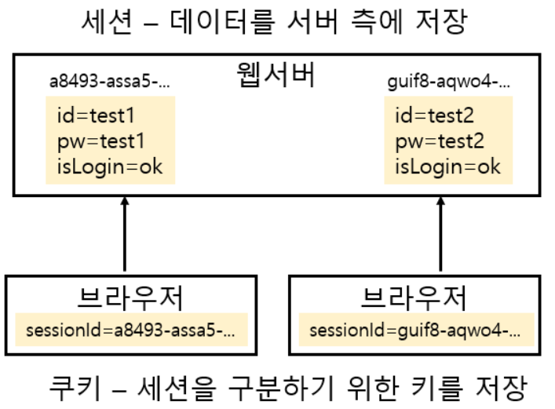
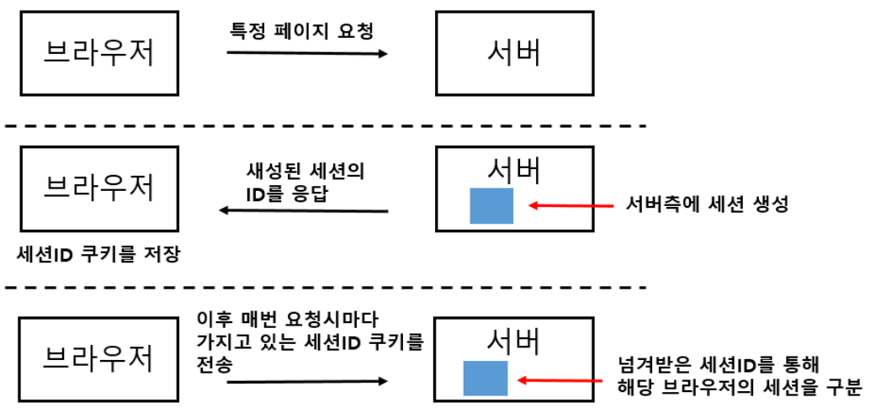
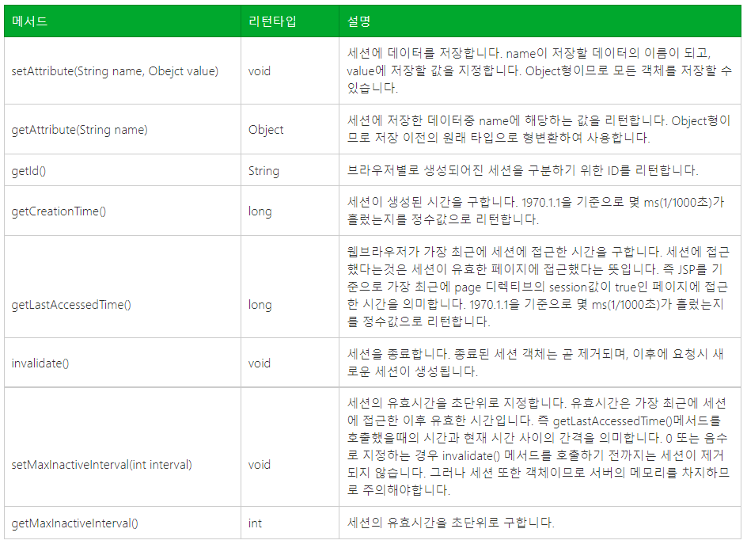

## 쿠키

**쿠키(Cookie)란?**

**웹 페이지들 사이의 공유 정보를 클라이언트 PC에 저장해 놓고 필요할 때 여러 웹 페이지들이 공유해서 사용할 수 있도록 매개 역할을 하는 것**

**특징**

\- 정보가 클라이언트 PC에 저장

\- 저장 정보 용량에 제한 있음

\- 보안 취약

\- 클라이언트 브라우저에서 사용 유무 설정 가능

\- 도메인당 쿠키가 만들어짐 (웹 사이트당 하나의 쿠키)

**쿠키 실행 과정**

1) 브라우저로 사이트 접속

2) 정보를 저장한 쿠키를 서버가 생성

3) 생성된 쿠키를 브라우저로 전송

4) 브라우저는 서버로부터 받은 쿠키 정보를 쿠키 파일에 저장

5) 브라우저에 다시 접속 시 서버가 브라우저에게 쿠키 전송을 요청하면 브라우저는 쿠키 정보를 서버에 넘김

6) 서버는 쿠키 정보를 이용해 작업 수행

**쿠키 API**

\- javax.servlet.http.Cookie 이용

\- HttpServletResponse의 addCookie() 메서드로 브라우저에 쿠키 전송 후 저장

\- HttpServletRequest의 getCookie() 메서드로 쿠키를 서버에 가져옴

**메서드**

\- getComment() : 쿠키에 대한 설명 가져오기

\- getDomain() : 쿠키의 유효한 도메인 정보 가져오기

\- getMaxAge() : 쿠키 유효 기간 가져오기

\- getName() : 쿠키 이름 가져오기

\- getPath() : 쿠키의 디렉터리 정보 가져오기

\- getValue() : 쿠키의 설정값을 가져오기

\- setComment(String) : 쿠키 설명 설정

\- setDomain(String) : 쿠키 유효 도메인 설정

\- setMaxAge(int) : 쿠키 유효 기간 설정

\- setValue(String) : 쿠키 값 설정

## 세션(Session)

**세션(Session)이란?**

세션은 HTTP 프로토콜을 이용하는 웹 환경에서 상태를 유지하기 위한 기술. HTTP는 요청과 응답으로 이루어지며, 새로고침이나 특정 URL을 요청할때마다 새로운 HTTP 요청이 생성되기때문에 이들간에 상태를 유지할 수 있는 방법이 없다. 예를들어 /login.do 라는 URL에서 로그인을 했다고 하더라도 /boards 페이지로 이동하게 되면 새로운 HTTP 요청이므로 로그인을 했다는 정보를 어딘가에 확인할 수 없다. DB를 통해 로그인시에 login이라는 상태를 저장 후 logout시에 logout이라고 update 하는 방식으로 하면 되는거 아니야? 라고 생각 할 수도 있겠지만 대규모 어플리케이션일수록 DB는 부하를 가장 많이 받는 대상이며, 연산이 늘어날수록 병목이 되는 대상이 되기때문에 최대한 부담을 어플리케이션쪽으로 몰아주는것이 좋다.

**세션이 생성되는 과정**

세션은 브라우저 단위로 생성되어지고 최초 요청시 생성되어진다. 또한 서버측에 생성되어진 세션은 브라우저별로 생성된 세션을 구분할 수 있는 세션 ID를 갖게 되는데, 세션이 생성 되어질 때 세션ID를 브라우저측에 응답하고 브라우저는 이것을 쿠키로 저장한다.

**세션객체의 메서드**

JSP/Servlet 환경에서 세션객체는 javax.servlet.http.HttpSession 타입의 객체이다. 세션 객체는 다음과 같은 메서드들을 가진다.

