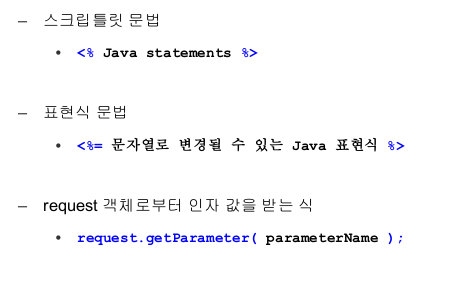
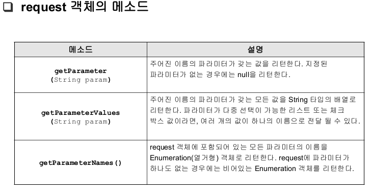
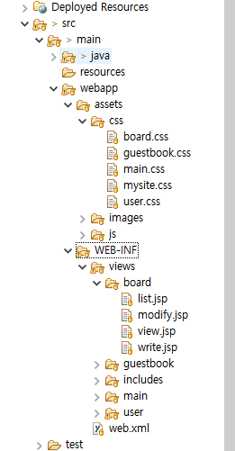
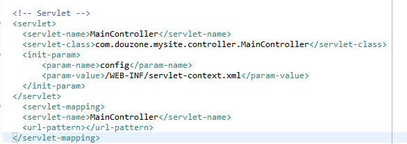
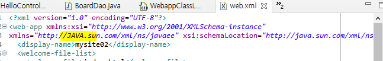

#### JSP코드 설명

<% %> : 자바문장을 포함하는 스크립틀릿 작성하기 위한 태그

<%= %>: 문자열로 변환되는 표현식을 출력

request.getParameter: JSP로 전달되는 파라미터 값을 얻는데 사용

**요청디스패치(forward) vs 리다이렉트**

- RequestDispatcher객체의 **forward메소드**는 동일 서버의 다른 자원에게 제어를 넘김
- 포워드는 새로운 페이지는 **이전 페이지에서 처리하던 것과 같은 요청을 처리**하게 하고 응답하여 브라우저는 하나 이상의 페이지가 연관 된 것을 알 수 없다.

- 다른 서버의 자원에 제어를 넘길때는 **response객체의 sendRedirect메소드를 사용한다.**
- 리다렉트는 첫번째 페이지는 브라우저에게 **새로운 페이지로 다시 요청**해야 한다는 내용의 응답을 보낸다.
- 둘 다 다른 페이지를 호출하는 방법이다.

**mysite프로젝트 초기설정**

mysite 프로젝트 pom형식으로 생성

src폴더 삭제

pom에 추가

  	<properties>
  		<project.build.sourceEncoding>UTF-8</project.build.sourceEncoding>
  		<project.reporting.outputEncoding>UTF-8</project.reporting.outputEncoding>
  	</properties>
  	
  	<dependencies>
  		<!-- Servlet -->
  		<dependency>
  			<groupId>javax.servlet</groupId>
  			<artifactId>javax.servlet-api</artifactId>
  			<version>3.0.1</version>
  			<scope>provided</scope>
  		</dependency>
  		<dependency>
  			<groupId>javax.servlet.jsp</groupId>
  			<artifactId>jsp-api</artifactId>
  			<version>2.0</version>
  			<scope>provided</scope>
  		</dependency>		
  	</dependencies>
  		
  	<build>
  		<sourceDirectory>src/main/java</sourceDirectory>
  		<resources>
  			<resource>
  				<directory>${project.basedir}/src/main/resources</directory>
  				<excludes>
  					<exclude>**/*.java</exclude>
  				</excludes>
  			</resource>
  		</resources>
  		<plugins>
  			<plugin>
  				<groupId>org.apache.maven.plugins</groupId>
  				<artifactId>maven-compiler-plugin</artifactId>
  				<version>3.8.0</version>
  				<configuration>
  					<source>1.8</source>
  					<target>1.8</target>
  				</configuration>
  			</plugin>
  			<plugin>
  				<groupId>org.apache.maven.plugins</groupId>
  				<artifactId>maven-resources-plugin</artifactId>
  				<configuration>
  					<encoding>UTF-8</encoding>
  				</configuration>
  			</plugin>
  			<plugin>
  				<groupId>org.apache.maven.plugins</groupId>
  				<artifactId>maven-war-plugin</artifactId>
  				<version>3.2.1</version>
  				<configuration>
  					<warSourceDirectory>src/main/webapp</warSourceDirectory>
  					<failOnMissingWebXml>true</failOnMissingWebXml>
  				</configuration>
  			</plugin>		
  		</plugins>

mysite02모듈 war형식으로 생성

 Java EE tool의 Generate Deployment Descriptor Stub 눌러주면

web.xml 생성

mysite02모듈의 pom.xml에 추가 

        <dependencies>
    <dependency>
    	<groupId>org.mariadb.jdbc</groupId>
    	<artifactId>mariadb-java-client</artifactId>
    	<version>2.7.2</version>
    </dependency>
      </dependencies>
      <build>
    	<finalName>mysite02</finalName>
    	<plugins>
    		<plugin>
    			<groupId>org.codehaus.mojo</groupId>
    			<artifactId>tomcat-maven-plugin</artifactId>
    			<configuration>
    				<url>http://127.0.0.1:8088/manager/text</url>
    				<path>/mysite02</path>
    				<username>admin</username>
    				<password>manager</password>
    			</configuration>
    		</plugin>			
    	</plugins>
    </build>

WEB-INF에 views폴더 생성, assets폴더 생성

 jsp파일 생성(강사님 자료파일 복사)

maincontroller 서블릿파일 생성

web.xml에 서블릿 추가

web의 **java.sun.com 의 java를 JAVA** 

으로 변경

