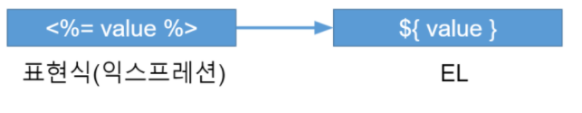
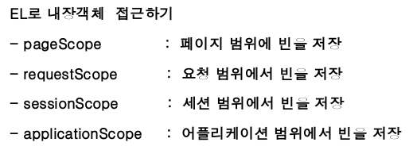
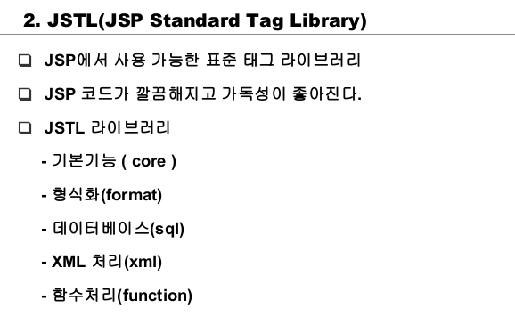
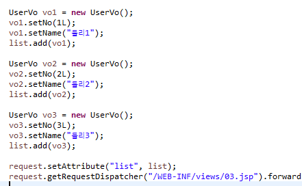
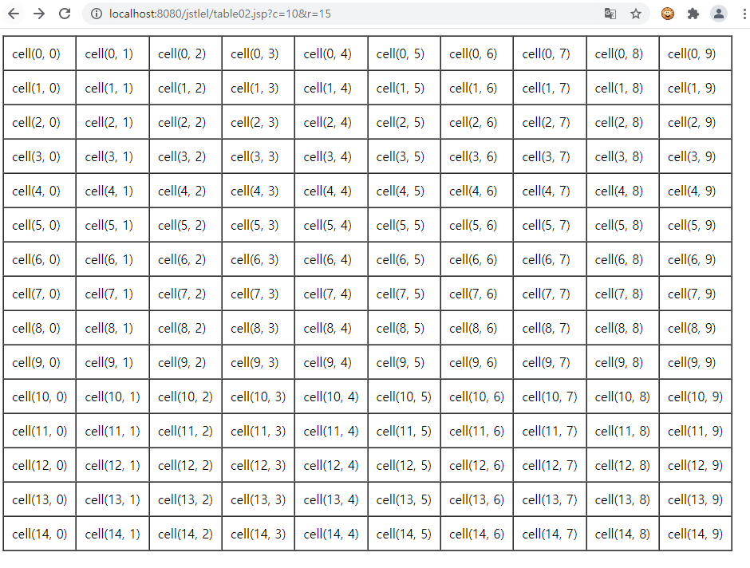
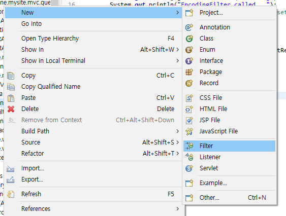
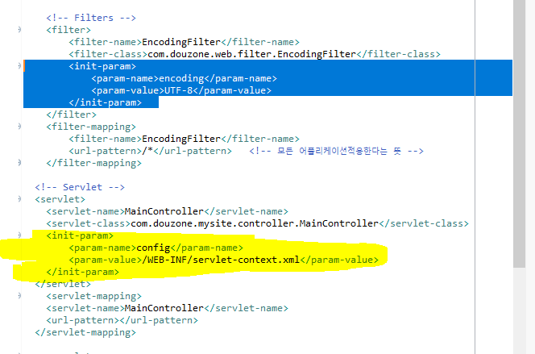
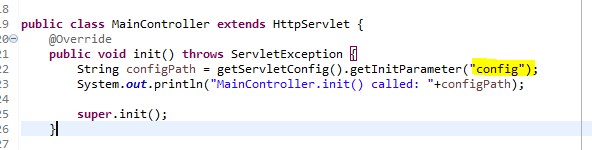
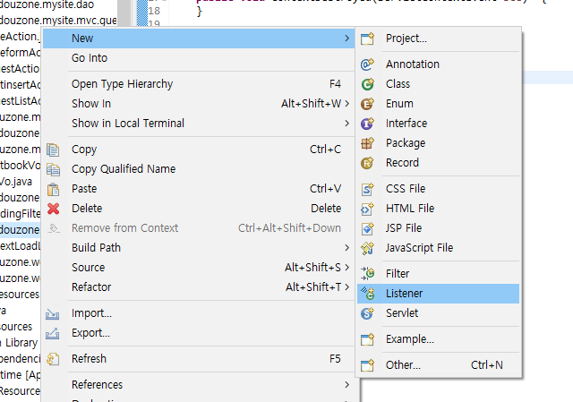

## JSTL(JSP Standard Tag Library) & EL(Expression Language)


### 1. EL

**EL(Expression Language: 표현언어)란, 표현식 또는 액션 태그를 대신해서 ‘값’을 표현하는 언어**

**Java 도 아니고, JSP 도 아니지만, JSP를 보완하는 스크립트 언어이다.**




'''

	<h4>값출력</h4>
	${iVal } <br>
	${lVal } <br>
	${fVal } <br>
	${bVal } <br>
	${sVal } <br>
	
	<h4>객체출력</h4>
	--${obj }-- <br>
	--${user.no }-- <br>
	--${user.name }-- <br>
	
	<h4>map의 값 출력</h4>
	${m.iVal } <br>
	${m.lVal } <br>
	${m.fVal } <br>
	${m.bVal } <br>
	
	<h4>산술연산</h4>
	${2+5*2/2 } <br>
	${iVal*2 } <br>
	
	<h4>관계연산</h4>
	${iVal == 10 } <br>
	${iVal < 10 } <br>
	${obj == null } <br>
	${obj != null } <br>
	${empty obj } <br>
	${not empty obj } <br>
	
	<h4>논리연산</h4>
	${iVal ==10 && lVal <1000} <br>
	${iVal ==10 || lVal <1000} <br>
	
	<h4>요청파라미터</h4>
	--${param.a + 10}--<br>
	--${param.email}--<br>


===================================

#### EL로 내장객체 접근




**1.Scope(범위) - 객체가 존재하는 범위**

**2.객체가 오래 지속되는 순서**

Application(Context) scope > Session scope > Request scope > Page scope

**3. EL이 이름으로 객체를 찾는 순서(내장객체 생략시 같은 이름의 객체에 대한 우선순위)**

Page scope >  Request scope  > Session scope > Application(Context) scope


### 2. JSTL




pom.xml에 추가

	  	<!-- jstl -->
		  	<dependency>
		    	<groupId>jstl</groupId>
		    	<artifactId>jstl</artifactId>
		    	<version>1.2</version>
			</dependency>


(태그 라이브러리 사용을 위해선 꼭 삽입해야함)


**태그 라이브러리삽입을 통해 사용가능**

```
<%@ taglib uri="http://java.sun.com/jsp/jstl/core" prefix="c"%>
<%@ taglib uri="http://java.sun.com/jsp/jstl/fmt" prefix="fmt"%>
<%@ taglib uri="http://java.sun.com/jsp/jstl/functions" prefix="fn"%>
```


**그냥 if문 사용예시**

```
	<c:if test='true'>
	<h1>hello</h1>
	</c:if>
```


**if-else문 사용예시**

```
<c:choose>
	<c:when test='${param.c == "red" }'>
		<h1 style="color:red">Hello World</h1>
	</c:when>
	<c:when test='${param.c == "green" }'>
		<h1 style="color:green">Hello World</h1>
	</c:when>
	<c:when test="${param.c == "blue" }">
		<h1 style="color:blue">Hello World</h1>
	</c:when>
	<c:otherwise>
		<h1 style="color:black">Hello World</h1>
	</c:otherwise>
</c:choose>
```


**servlet에서 리스트 값 삽입후 아래의foreach문 사용**



**forEach문 사용예시**

		<c:set var='count' value='${fn:length(list) }'/>
		
		<c:forEach items='${list }' var='vo' varStatus='status'>
			[${count-status.index }] (${status.index }:${status.count }) [${vo.no }:${vo.name }]<br/>
		</c:forEach>


**table02.jsp**

```
<%@ taglib uri="http://java.sun.com/jsp/jstl/core" prefix="c"%>
<%@ taglib uri="http://java.sun.com/jsp/jstl/fmt" prefix="fmt"%>
<%@ taglib uri="http://java.sun.com/jsp/jstl/functions" prefix="fn"%>
<%@ page language="java" contentType="text/html; charset=UTF-8" pageEncoding="UTF-8"%>
<!DOCTYPE html>
<html>
<head>
<meta charset="UTF-8">
<title>Insert title here</title>
</head>
<body>
	<c:set var='row' value='${param.r }' />
	<c:set var='col' value='${param.c }' />
	
	<c:if test='${empty row }'>
		<c:set var='row' value='3' />
	</c:if>

	<c:if test='${empty col }'>
		<c:set var='col' value='3' />
	</c:if>
	
	<table border="1" cellspacing='0' cellpadding='10'>
		<c:forEach begin='0' end='${row-1 }' step='1' var='r'>
			<tr>
				<c:forEach begin='0' end='${col-1 }' step='1' var='c'>
					<td>cell(${r }, ${c })</td>
				</c:forEach>
			</tr>
		</c:forEach>
	</table>
</body>
</html>
```

<c:set>을 통한 변수 설정


**값을 설정하지 않을경우 디폴드로 3X3**


**10X15 로 값설정한 경우**




##### c:import

```
<c:import url="/WEB-INF/views/includes/header.jsp"/>
```

<c:import url="url"> 은 <jsp:include> 처럼 다른 페이지를 동적으로 포함시킬때 사용


##### 서블릿 라이프 사이클(서블릿의 흐름 파악용)

```
package helloweb;

import java.io.IOException;
import javax.servlet.ServletConfig;
import javax.servlet.ServletException;
import javax.servlet.http.HttpServlet;
import javax.servlet.http.HttpServletRequest;
import javax.servlet.http.HttpServletResponse;


public class LifeCycleservlet extends HttpServlet {
	private static final long serialVersionUID = 1L;

	public void init() throws ServletException {
		System.out.println("LifeCycleServlet.init(...) called");
		super.init();
	}
//init메소드를 통해 서블릿을 구동하고 초기화한다


	protected void service(HttpServletRequest request, HttpServletResponse response) throws ServletException, IOException {
		System.out.println("LCS.servive(...) called");
		super.service(request, response);
	} 
	//service메소드를 통해 서블릿이 브라우저의 요청을 처리하도록함
	//service메소드는 doGet, doPost메소드를 호출한다.

	protected void doGet(HttpServletRequest request, HttpServletResponse response) throws ServletException, IOException {
		System.out.println("LCS.doGet(...) called");
	
	}
	//


	protected void doPost(HttpServletRequest request, HttpServletResponse response) throws ServletException, IOException {
		// TODO Auto-generated method stub
		System.out.println("LCS.doPost(...) called");
		doGet(request, response);
	}


	public void destroy() {
		// TODO Auto-generated method stub
		System.out.println("LCS.destroy(...) called");
		super.destroy();
	}
	//destroy메소드를 통해 서블릿을 제거
}

```


**EncodingFilter: 일반적으로 서블릿에서 request.setCharacterEncoding(encoding); 의 처리의 불편함을 없애기 위한것,** 

**필터는 서블릿에서 중복되는 작업을 미리해준다.**

(request.setCharacterEncoding(encoding);는 영어권 개발자가 아닌경우 필수적으로 인코딩해야하는 작업이다.)


web.xml에  추가

```
  <!--Filters -->
  <filter>
  	<filter-name>EncodingFilter</filter-name>
  	<filter-class>com.douzone.web.filter.EncodingFilter</filter-class>
  	<init-param>
  		<param-name>encoding</param-name>
  		<param-value>UTF-8</param-value>
  	</init-param>
  </filter>
  <filter-mapping>
  	<filter-name>EncodingFilter</filter-name>
  	<url-pattern>/*</url-pattern> <!-- 모든 어플리케이션에 적용된다는뜻-->
  </filter-mapping>
```


filter로 생성



**EncodingFilter** 

```
package com.douzone.web.filter;

import java.io.IOException;
import javax.servlet.Filter;
import javax.servlet.FilterChain;
import javax.servlet.FilterConfig;
import javax.servlet.ServletException;
import javax.servlet.ServletRequest;
import javax.servlet.ServletResponse;

public class EncodingFilter implements Filter {
	private String encoding;
	
	public void init(FilterConfig fConfig) throws ServletException {
		encoding = fConfig.getInitParameter("encoding");
		System.out.println("EncodingFilter called...");
		if(encoding == null) { // default encoding charset
			encoding = "UTF-8";
		}
	}

	public void doFilter(ServletRequest request, ServletResponse response, FilterChain chain) throws IOException, ServletException {
		/* request */
		request.setCharacterEncoding(encoding);
		chain.doFilter(request, response);
		
		/* response */
	}

	public void destroy() {
	}

}
```


**init-param**

해당 파라미터 값은 지정해준 서블릿 내에서만 쓸 수 있는 값이다. 변수로 생각하자면 Private 지역변수와 유사하다고 생각할 수 있을 것 같다.

<!-- init 파라미터는 해당 서블릿에서만 사용 가능하다. -->





MainController에서 활용하는 법




**context-param**

context-param은 init-param 그 이상으로 전역 즉 모든 서블릿에서 사용할 수 있는 파라미터 값이다. 위에서 init-param이 지역변수라면 해당 파라미터는 전역변수라고 생각하면 될 것 같다.

그렇기 때문에 <context-param>은 어느 하나의 서블릿 태그안에 속하는 것이 아닌 독립적으로 추가해준다.

web.xml에 추가

```
 	<context-param>
		<param-name>contextConfigLocation</param-name>
		<param-value>/WEB-INF/applicationContext.xml</param-value>
	</context-param>
```


**contextloadListener**

서블릿 컨테이너가 web.xml 파일을 읽어서 구동될때 자동으로 메모리에 생성된다.

 즉, ContextLoaderListener는 클라이언트의 요청이 없어도 컨테이너에 구동될 때, **Pre-Loading** 되는 객체이다.


web.xml에 추가

```
	<!-- Context Load Listener -->
	<listener>
		<listener-class>com.douzone.web.listener.ContextLoadListener</listener-class>
	</listener>
```


Listener로 생성




**ContextLoadListener**

```
package com.douzone.web.listener;

import javax.servlet.ServletContext;
import javax.servlet.ServletContextEvent;
import javax.servlet.ServletContextListener;
import javax.servlet.annotation.WebListener;


public class ContextLoadListener implements ServletContextListener {


    public void contextInitialized(ServletContextEvent sce)  { 
    	ServletContext sc = sce.getServletContext();
    	String contextConfigLocation = sc.getInitParameter("contextConfigLocation");
    	System.out.println("Application starts....:" +contextConfigLocation);
    }
    public void contextDestroyed(ServletContextEvent sce)  { 
    }
}

```

**context-param** 로 선언해둔 contextConfigLocation 을 읽어오게끔 설정하는 것이다.


