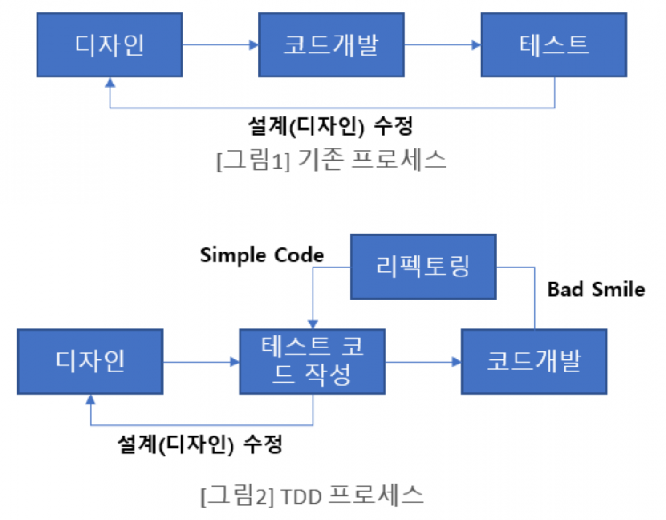
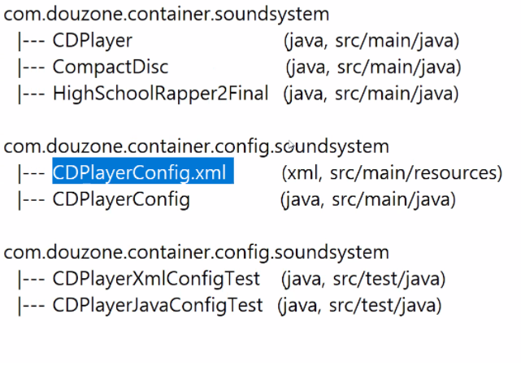
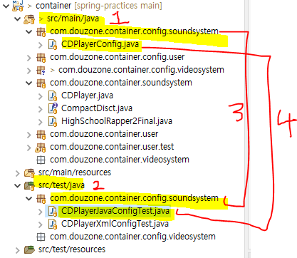
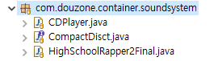

# TDD

### TDD란 무엇인가?

Test Driven Development의 약자, 테스트 주도 개발이라고한다

기존 그림1과는 다르게 테스트 케이스를 먼저 작성 후 실제 코드를 개발하여 리팩토링하는 절차를 따른다




### **TDD를 왜 해야할까**

1. 처음해보는 프로그램 주제
   
    나에 대한 불확실성이 높은 경우
    
2. 고객의 요구조건이 바뀔 수 있는 프로젝트
   
    외부적인 불확실성이 높은 경우
    
3. 개발하는 중에 코드를 많이 바꿔야 된다고 생각하는 경우
4. 내가 개발하고 나서 이 코드를 누가 유지보수할 지 모르는 경우
   
    외부적인 불확실성이 즉, 불확실성이 높을 때 TDD를 하면 된다.
    

모든 애자일의 실천법은 피드백과 협력을 동시에 증진시킨다.


### **TDD 개발 방식의 장점**

1. 보다 튼튼한 객체 지향적인 코드 생산

   TDD는 코드의 재사용 보장을 명시하므로 TDD를 통한 소프트웨어 개발 시 기능 별 철저한 모듈화가 이뤄진다

   이는 종속성과 의존성이 낮은 모듈로 조합된 소프트웨어 개발을 가능하게 하며 필요에 따라 모듈을 추가하거나 제거해도 소프트웨어 전체 구조에 영향을 미치지 않게 된다

2. 재설계 시간의 단축

   테스트 코드를 먼저 작성하기 때문에 개발자가 지금 무엇을 해야하는지 분명히 정의하고 개발을 시작하게 된다. 또한 테스트 시나리오를 작성하면서 다양한 예외사항에 대해 생각해볼 수 있다. 이는 개발 진행 중 소프트웨어의 전반적인 설계가 변경되는 일을 방지할 수 있다

3. 디버깅 시간의 단축

   이는 유닛 테스팅을 하는 이점이기도 하다

   예를 들면 사용자의 데이터가 잘못 나온다면 DB의 문제인지, 비즈니스 레이어의 문제인지 UI의 문제인지 실제 모든 레이어들을 전부 디버깅해야하지만, 

   TDD의 경우 자동화 된 유닛 테스팅을 전제하므로 특정 버그를 손쉽게 찾아낼 수 있다

4. 테스트 문서의 대체 가능

   주로 SI 프로젝트 진행 과정에서 어떤 요소들이 테스트 되었는지 테스트 정의서를 만든다

   이것은 단순 통합 테스트 문서에 지나지 않는다

   하지만 TDD를 하게 될 경우 테스팅을 자동화 시킴과 동시에 보다 정확한 테스트 근거를 산출할 수 있다

5. 추가 구현의 용이함

   개발이 완료된 소프트웨어에 어떤 기능을 추가할 때 가장 우려되는 점은 해당 기능이 기존 코드에 어떤 영향을 미칠지 알지 못한다는 것이다

   하지만 TDD의 경우 자동화된 유닛 테스팅을 전제하므로 테스트 기간을 획기적으로 단축시킬 수 있다


### **TDD 개발 방식의 단점**

가장 큰 단점은 바로 생산성의 저하이다.

개발 속도가 느려진다고 생각하는 사람이 많기 때문에 TDD에 대해 반신반의 한다

왜냐하면 처음부터 2개의 코드를 짜야하고, 중간중간 테스트를 하면서 고쳐나가야 하기 때문이다 TDD 방식의 개발 시간은 일반적인 개발 방식에 비해 대략 10~30% 정도로 늘어난다

SI 프로젝트에서는 소프트웨어의 품질보다 납기일 준수가 훨씬 중요하기 때문에 TDD 방식을 잘 사용하지 않는다


### TDD 테스트 예제

#### 1.pom.xml 에 JUnit디펜던시 추가

```xml
		<!-- test -->
		<dependency>
			<groupId>org.springframework</groupId>
			<artifactId>spring-test</artifactId>
			<version>${org.springframework-version}</version>
			<scope>test</scope>
		</dependency>
		<dependency>
			<groupId>junit</groupId>
			<artifactId>junit</artifactId>
			<version>4.12</version>
			<scope>test</scope>
		</dependency>
		<dependency>
			<groupId>com.github.stefanbirkner</groupId>
			<artifactId>system-rules</artifactId>
			<version>1.19.0</version>
			<scope>test</scope>
		</dependency>
```


#### 2.프로젝트 패키지 구성





1. /src/main/java는 자바코드 보관
2. /src/test/java는 단위 테스트의 소스 보관
3. 테스트 하고자 하는 클래스가 포함된 패키지명과 테스트 클래스를 포함하는 패키지명 **동일하게 구성**
4. **테스트 클래스**와  **테스트 대상 클래스**와의 생성 예이다.


#### 3.테스트 클래스

3-1. CDPlayerConfig

```java
package com.douzone.container.config.soundsystem;

import org.springframework.context.annotation.ComponentScan;
import org.springframework.context.annotation.Configuration;

@Configuration
@ComponentScan(basePackages= {"com.douzone.container.soundsystem"})
public class CDPlayerConfig {
	
}
```

- **@Componentscan** 어노테이션은 @Component어노테이션 및 streotype(@Service, @Repository, @Controller)어노테이션이 부여된 Class들을 자동으로 Scan하여 Bean으로 등록해주는 역할을 한다.




3-2.HighSchoolRapper2Final (테스트  클래스)

```java
package com.douzone.container.soundsystem;

import org.springframework.stereotype.Component;

@Component
public class HighSchoolRapper2Final implements CompactDisct {
	private String artist = "김하온";
	private String title = "붕붕";
	
	@Override
	public void play() {
		System.out.println("Playing " + title + " by " + artist);
	}

}
```


#### 4.테스트 대상 클래스

CDPlayerJavaConfigTest

```java
package com.douzone.container.config.soundsystem;

@RunWith(SpringJUnit4ClassRunner.class)
@ContextConfiguration(classes= {CDPlayerConfig.class})
public class CDPlayerJavaConfigTest {

	
	@Rule
	public final SystemOutRule systemOutRule = new SystemOutRule().enableLog();
	
	@Autowired
	private CDPlayer cdplayer;
	
	@Test
	public void testCDPlayerNotNull() {
		assertNotNull(cdplayer);
	}
	
	@Test
	public void testPlay() {
		cdplayer.play();
		assertEquals("Playing 붕붕 by 김하온", systemOutRule.getLog().replace("\r\n", "").replace("\n", ""));
	}
}

```

- **@RunWith:**  스프링 테스트를 위해서 SpringJUnit4ClassRunner라는 Runner 클래스를 설정
- **@ContextConfiguration**: 자동으로 만들어줄 애플리케이션 컨텍스트의 설정파일 위치를 지정
- **@Test**어노테이션을 선언하여 testPlay()가 단위 테스트 메서드임을 선언

- **Assert 클래스**의 정적 메서드인 assertEquals를 이용하여 테스트 결과 값을 확인한다

| **assert 메서드**        | **설명**                                                     |
| ------------------------ | ------------------------------------------------------------ |
| assertArrayEquals(a, b); | 배열 A와 B가 일치함을 확인한다.                              |
| assertEquals(a, b);      | 객체 A와 B가 일치함을 확인한다.                              |
| assertSame(a, b);        | 객체 A와 B가 같은 객임을 확인한다. assertEquals 메서드는 두 객체의 값이 같은가를 검사는데 반해 assertSame메서드는 두 객체가 동일한가 즉 하나의 객인 가를 확인한다.(== 연산자) |
| assertTrue(a);           | 조건 A가 참인가를 확인한다.                                  |
| assertNotNull(a);        | 객체 A가 null이 아님을 확인한다.                             |


https://epthffh.tistory.com/entry/Junit%EC%9D%84-%EC%9D%B4%EC%9A%A9%ED%95%9C-%EB%8B%A8%EC%9C%84%ED%85%8C%EC%8A%A4%ED%8A%B8
