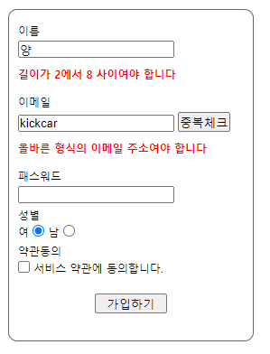
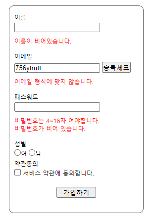
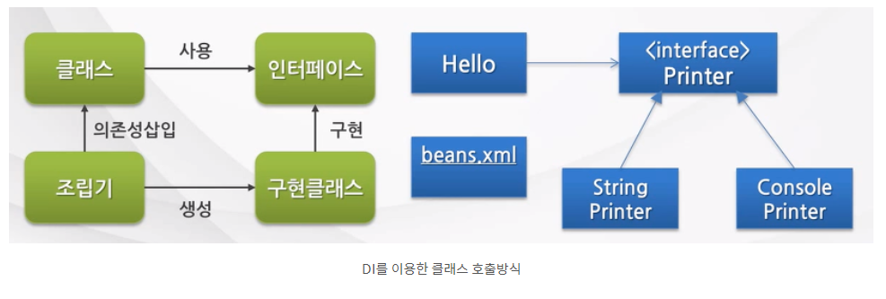

### @Valid란?

- JSR-303 표준 스펙으로써 제약 조건이 부여된 객체에 대해 빈 검증기(Bean Validator)를 이용해서 검증하도록 지시하는 어노테이션이다.

- 객체의 필드에 달린 제약조건 어노테이션을 참고해 검증을 편리하게 할 수 있다.


### **[ 다양한 제약조건 어노테이션 ]**

@AssertFalse : 거짓인가?

@Max : 지정 값 이하인가?

@AssertTrue : 참인가?

@Min : 지정 값 이상인가?

@DecimalMax : 지정 값 이하 실수인가?

@NotNull : Null이 아닌가?

@DecimalMin : 지정 값 이상 실수인가?

@Null : Null인가?

@Digits ( integer=, fraction=) : 대상 수가 지정된 정수, 소수 자리 수 이내 인가?

@Pattern(regex=, flag=) : 정규식을 만족 하는가?

@Future : 미래날짜인가?

@Past : 과거 날짜인가?

@Size(min=, max=)
: 문자열, 배열 등의 크기가 지정크기를 만족 하는가?


**hibernate-validator**

@NotEmpty : Empty 값이 아닌가?

@Email: 이메일 형식

@URL: URL 형식

@Length(min=, max=): 문자열 길이 min과 max 사이인가?

@Range(min=, max=): 숫자 범위 체크


pom.xml Dependency추가

```
		<!-- validation -->
		<dependency>
			<groupId>javax.validation</groupId>
			<artifactId>validation-api</artifactId>
			<version>1.0.0.GA</version>
		</dependency>
		<dependency>
			<groupId>org.hibernate</groupId>
			<artifactId>hibernate-validator</artifactId>
			<version>4.2.0.Final</version>
		</dependency>
```


**회원가입에서 데이터 유효성 검증**

uservo - 어노테이션 추가

```java
public class UserVo {
	private Long no;
	
	@NotEmpty
	@Length(min=2, max=8)
	private String name;
	
	@NotEmpty
	@Email
	private String email;
	
	@NotEmpty
	@Length(min=4, max=16)
	private String password;
	}
```


UserController  - join()메서드

```java

@RequestMapping(value="/join", method=RequestMethod.POST)
	public String join(@Valid UserVo vo, BindingResult result) {
		
		if(result.hasErrors()) {
			List<ObjectError> list = result.getAllErrors();
			for(ObjectError error : list) {
				System.out.println(error);
			}
		}
		//userService.join(vo);
		return "redirect:/user/joinsuccess";
	}
```

- 제약조건을 만족하지않으면 콘솔에 에러 출력


ex) 에러내용

> Field error in object 'userVo' on field 'name': rejected value []; codes [Length.userVo.name,Length.name,Length.java.lang.String,Length]; arguments [org.springframework.context.support.DefaultMessageSourceResolvable: codes [userVo.name,name]; arguments []; default message [name],8,2]; default message [길이가 2에서 8 사이여야 합니다]
> Field error in object 'userVo' on field 'password': rejected value []; codes [NotEmpty.userVo.password,NotEmpty.password,NotEmpty.java.lang.String,NotEmpty]; arguments [org.springframework.context.support.DefaultMessageSourceResolvable: codes [userVo.password,password]; arguments []; default message [password]]; default message [비어 있을 수 없습니다]
> Field error in object 'userVo' on field 'password': rejected value []; codes [Length.userVo.password,Length.password,Length.java.lang.String,Length]; arguments [org.springframework.context.support.DefaultMessageSourceResolvable: codes [userVo.password,password]; arguments []; default message [password],16,4]; default message [길이가 4에서 16 사이여야 합니다]
> Field error in object 'userVo' on field 'email': rejected value []; codes [NotEmpty.userVo.email,NotEmpty.email,NotEmpty.java.lang.String,NotEmpty]; arguments [org.springframework.context.support.DefaultMessageSourceResolvable: codes [userVo.email,email]; arguments []; default message [email]]; default message [비어 있을 수 없습니다]
> Field error in object 'userVo' on field 'name': rejected value []; codes [NotEmpty.userVo.name,NotEmpty.name,NotEmpty.java.lang.String,NotEmpty]; arguments [org.springframework.context.support.DefaultMessageSourceResolvable: codes [userVo.name,name]; arguments []; default message [name]]; default message [비어 있을 수 없습니다]


**에러메시지 출력**

jsp에서 태그라이브러리 추가

```
<%@ taglib uri="http://www.springframework.org/tags" prefix="spring" %>
```

join.jsp 에 추가

```
<spring:hasBindErrors name="userVo">
<c:if test="${errors.hasFieldErrors('name') }">
<strong>${errors.getFieldError( 'name' ).defaultMessage }</strong>
</c:if>
</spring:hasBindErrors>
```




**커스텀 메세지**

spring-servlet.xml 에 추가

```xml
	<!-- 6. MessageSource --><!-- 커스텀메세지 -->
	<bean id="messageSource" class="org.springframework.context.support.ResourceBundleMessageSource">
		<property name="basenames">
			<list>
				<value>messages/messages_ko</value>
			</list>
		</property>
	</bean>	
```

- resource/messages/messages_ko.properties 에서 사용자가 원하는대로 설정가능

> ex)
>
> NotEmpty.userVo.name = \uC774\uB984\uC740 \uD544\uC218 \uC785\uB825
> \uD56D\uBAA9\uC785\uB2C8\uB2E4.
>
> 원하는 문장 입력시 저렇게 변환됨


커스텀 메시지 출력

```jsp
					<p style="text-align:left; padding-left:0; color: #f00">
						<spring:hasBindErrors name="userVo">
							<c:if test="${errors.hasFieldErrors('name') }">
								<spring:message code="${errors.getFieldError('name').codes[0] }" />
							</c:if>
						</spring:hasBindErrors>
					</p>
```




https://dog-developers.tistory.com/12

## IoC Container

- **IoC : ** 객체의 생성, 생명주기의 관리까지 모든 객체에 대한 제어권이 바꿔었다는 것을 의미
- **IoC 컨테이너:**
  - IoC 컨테이너는 객체의 생성을 책임지고, 의존성을 관리한다.
  - POJO의 생성, 초기화, 서비스, 소멸에 대한 권한을 가진다.
  - 개발자들이 직접 POJO를 생성할 수 있지만 컨테이너에게 맡긴다.


#### IoC 분류

DL(Dependency Lookup) 과 DI(Dependency Injection)이있는데

주로 DI를 사용함.

- **DL** : 저장소에 저장되어 있는 Bean에 접근하기 위해 컨테이너가 제공하는 API를 이용하여 Bean을 Lookup 하는 것

- **DI :** 각 클래스간의 의존관계를 빈 설정(Bean Definition) 정보를 바탕으로 컨테이너가 자동으로 연결해주는 것

  - 개발자들은 단지 빈 설정파일에서 의존관계가 필요하다는 정보를 추가하면 된다.

  - 객체 레퍼런스를 컨테이너로부터 주입 받아서, 실행 시에 동적으로 의존관계가 생성된다.

  - 컨테이너가 흐름의 주체가 되어 애플리케이션 코드에 의존관계를 주입해 주는 것이다.


#### DI 유형

- **Setter Injection (Setter 메서드를 이용한 의존성 삽입)** : 의존성을 입력 받는 setter 메서드를 만들고 이를 통해 의존성을 주입한다.
- **Constructor Injection (생성자를 이용한 의존성 삽입)** : 필요한 의존성을 포함하는 클래스의 생성자를 만들고 이를 통해 의존성을 주입한다.
- **Method Injection (일반 메서드를 이용한 의존성 삽입)** : 의존성을 입력 받는 일반 메서드를 만들고 이를 통해 의존성을 주입한다.




applicationContext.xml에 빈설정

```xml
<?xml version="1.0" encoding="UTF-8"?>
<beans xmlns="http://www.springframework.org/schema/beans"
	xmlns:xsi="http://www.w3.org/2001/XMLSchema-instance"
	xmlns:aop="http://www.springframework.org/schema/aop"
	xmlns:context="http://www.springframework.org/schema/context"
	xsi:schemaLocation="http://www.springframework.org/schema/beans
		http://www.springframework.org/schema/beans/spring-beans.xsd
		http://www.springframework.org/schema/aop http://www.springframework.org/schema/aop/spring-aop.xsd
		http://www.springframework.org/schema/context
		http://www.springframework.org/schema/context/spring-context.xsd
		http://www.springframework.org/schema/jee http://www.springframework.org/schema/jee/spring-jee.xsd
		http://www.springframework.org/schema/lang http://www.springframework.org/schema/lang/spring-lang.xsd
		http://www.springframework.org/schema/tx http://www.springframework.org/schema/tx/spring-tx.xsd
		http://www.springframework.org/schema/util http://www.springframework.org/schema/util/spring-util.xsd
		http://www.springframework.org/schema/task http://www.springframework.org/schema/task/spring-task.xsd">

	<bean id="user1" class="com.douzone.container.user.User1" />
	
	<!-- 기본 생성자로 빈 생성하기 -->
	<bean id="user" name="usr" class="com.douzone.container.user.User" />

	<!-- 파라미터 1개인 생성자로 빈 생성하기 -->
	<bean id="user2" name="usr2" class="com.douzone.container.user.User">
		<constructor-arg value="둘리"/>
	</bean>

	<!-- 파라미터 2개인 생성자로 빈 생성하기1 -->
	<bean id="user3" class="com.douzone.container.user.User">
		<constructor-arg value="3"/>
		<constructor-arg value="마이콜"/>
	</bean>

	<!-- 파라미터 2개인 생성자로 빈 생성하기2 -->
	<bean id="user4" class="com.douzone.container.user.User">
		<constructor-arg index="1" value="또치"/>
		<constructor-arg index="0" value="4"/>
	</bean>
	
	<!-- setter 사용하기 -->
	<bean id="user5" class="com.douzone.container.user.User">
		<property name="no" value="5"/>
		<property name="name" value="도우너"/>
	</bean>	

	<!-- DI하기 -->
	<bean id="friend" class="com.douzone.container.user.Friend">
		<constructor-arg value="길동"/>
	</bean>
	<bean id="user6" class="com.douzone.container.user.User">
		<property name="no" value="6"/>
		<property name="name" value="영희"/>
		<property name="friend" ref="friend" />
	</bean>			
	
	<!-- setter를 사용한 List 세팅하기 -->
	<bean id="user7" class="com.douzone.container.user.User">
		<property name="no" value="7"/>
		<property name="name" value="아이언맨" />
		<property name="friends">
			<list>
				<value>스파이더맨</value>
				<value>캡틴아메리카</value>
				<value>헐크</value>
			</list>
		</property>
	</bean>			
</beans>
```


User클래스

```java
package com.douzone.container.user;

import java.util.List;

public class User {
	private Long no = 0L;
	private String name = "안대혁";
	private Friend friend;
	private List<String> friends;
	
	public User() {
	}
	
	public User(String name) {
		this.name = name;
	}

	public User(Long no, String name) {
		this.no = no;
		this.name = name;
	}
	
	public void setNo(Long no) {
		this.no = no;
	}

	public void setName(String name) {
		this.name = name;
	}
	
	public void setFriend(Friend friend) {
		this.friend = friend;
	}

	public void setFriends(List<String> friends) {
		this.friends = friends;
	}

	@Override
	public String toString() {
		return "User [no=" + no + ", name=" + name + ", friend=" + friend + ", friends=" + friends + "]";
	}
}
```


흐름을 이해하기 위한 테스트 메소드

```java
	private static void testApplicationContext02() {
		ApplicationContext ac = 
				new ClassPathXmlApplicationContext("com/douzone/container/config/user/applicationContext02.xml");
		
		User user = null;
		
		// id로 빈 가져오기
		user = (User)ac.getBean("user");
		System.out.println(user);

		// name으로 빈 가져오기
		user = (User)ac.getBean("usr");
		System.out.println(user);

		// Type으로 빈 가져오기
		// 같은 타입의 빈이 두개 이상 있으면 type으로 가져오면 Error!!!!
		// 1. id + type
		// 2. name + type
		user = ac.getBean("user2", User.class);
		System.out.println(user);
		
		// 2개 파라미터로 생성된 빈 가져오기1
		user = ac.getBean("user3", User.class);
		System.out.println(user);
		
		// 2개 파라미터로 생성된 빈 가져오기2
		user = ac.getBean("user4", User.class);
		System.out.println(user);
		
		// setter를 사용한 빈 가져오기1
		user = ac.getBean("user5", User.class);
		System.out.println(user);

		// setter를 사용한 빈 가져오기2(DI)
		user = ac.getBean("user6", User.class);
		System.out.println(user);
		
		// setter를 사용한 빈 가져오기3(List Property)
		user = ac.getBean("user7", User.class);
		System.out.println(user);
	}
```

출력결과

> User [no=0, name=안대혁, friend=null, friends=null]
> User [no=0, name=안대혁, friend=null, friends=null]
> User [no=0, name=둘리, friend=null, friends=null]
> User [no=3, name=마이콜, friend=null, friends=null]
> User [no=4, name=또치, friend=null, friends=null]
> User [no=5, name=도우너, friend=null, friends=null]
> User [no=6, name=영희, friend=Friend [name=길동], friends=null]
> User [no=7, name=아이언맨, friend=null, friends=[스파이더맨, 캡틴아메리카, 헐크]]


